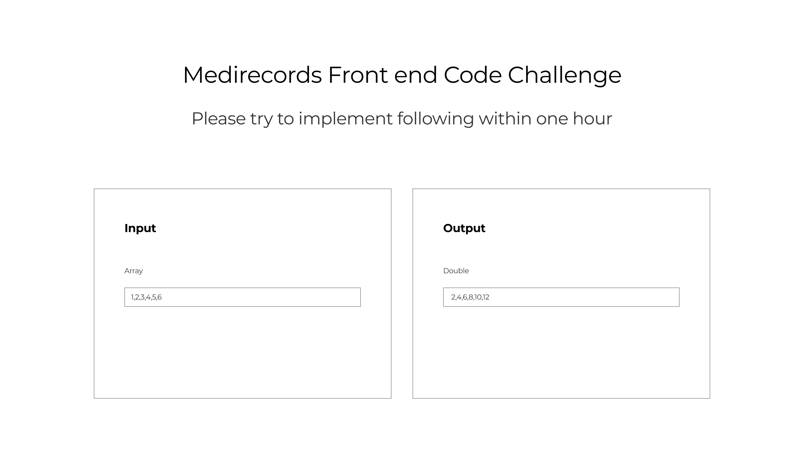

# MediRecords front end test
## Intro 

Please use React to achieve the design

### Features
* Styling the content with
  * html
  * Styling of your choice: sass/css or css in js
* Function
  * When user change input content, the out put would be updated; so `3,4,5,6` will convert to output box and rendering as `6,8,10,12` with javascript 
### Time frame
  * Within one hour: The code would be the start point for face to face interview, focus on overall structure first, if you may not be able to finish in time
## Code will be evaluated against 
* Implementation and details in 
  * Javascript & React
  * Styling of your choice
  * html 

## Good to have but not necessary
* Typescript
* Unit test
* Git history of your implementation: a link to your public repo of this challenge

## Do not need worry about
* [Google font](https://fonts.google.com/specimen/Montserrat) 

## Resources 
* Feel free to use [Create React App](https://reactjs.org/docs/create-a-new-react-app.html)